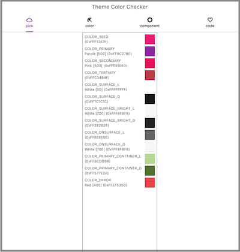
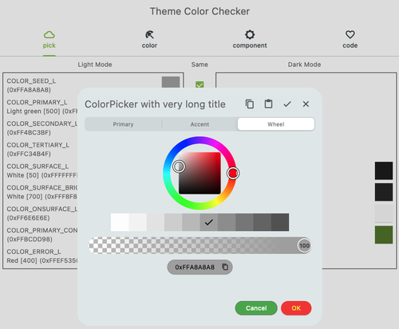
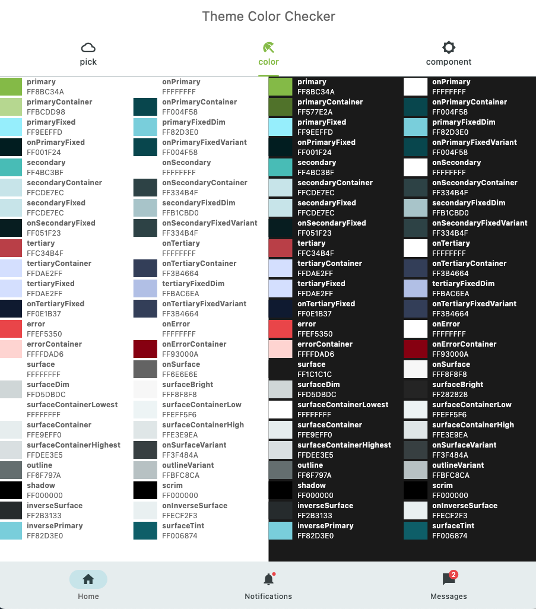
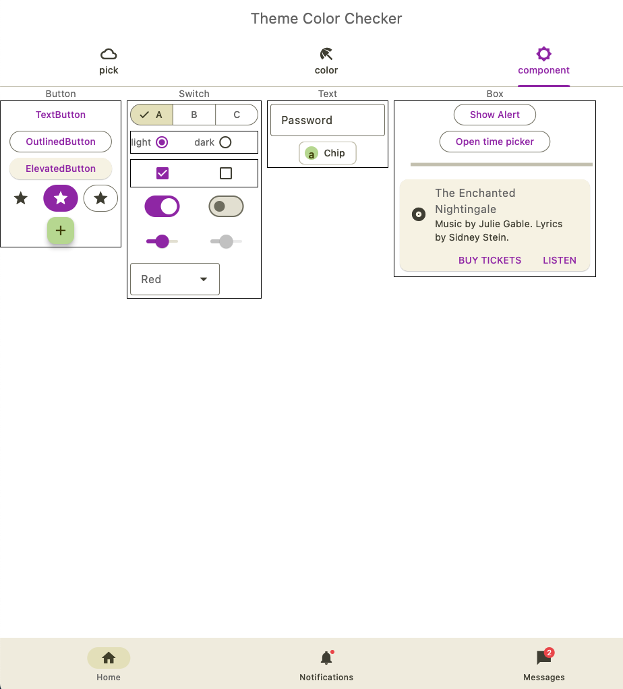
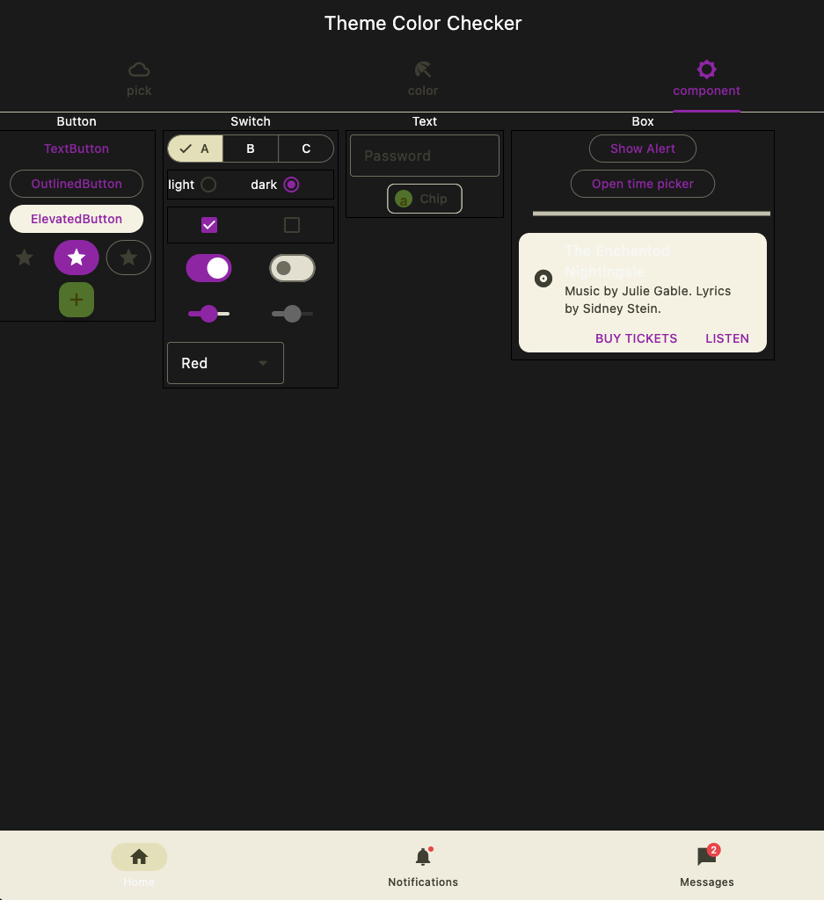

# flutter_theme_color_check

pickup color and check how it looks in widgets.

## How to use
1. Goto "Pick" tab
  

2. Push Colored Box and select the color
  

3. Goto "Color" tab
  

4. Goto "Component" tab
  
  
