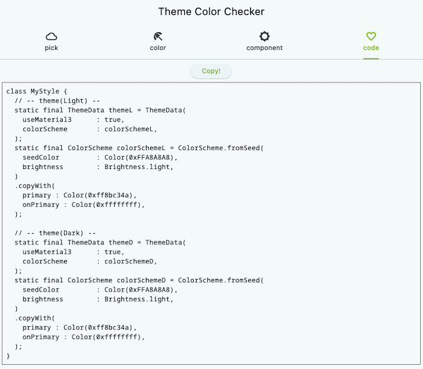

# flutter_theme_color_check

Pickup colors, check how they look, and get code.

## How to use
1. This app starts with "Pick" tab.  
  

2. Push Colored Box and select the color.  
  

3. Goto "Color" tab and check the theme color.  
  

4. Goto "Component" tab and check how widgets look.  
  
  

5. Goto "Code" tab and copy the code.  
  

## Run
Required H930 x W900 screen size, so
recommended to run on the desktop.

## Things I'd like to add
* Add some more components
* Add more Color elements in ColorScheme
  
**Pull requests are very welcome ^^**  